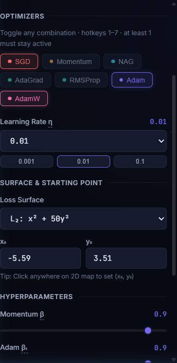
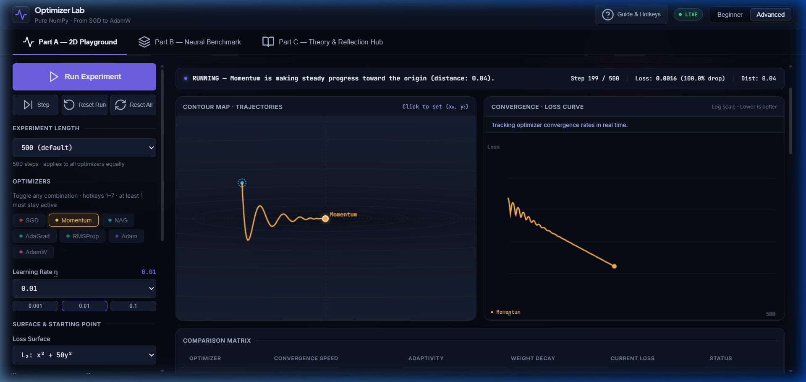
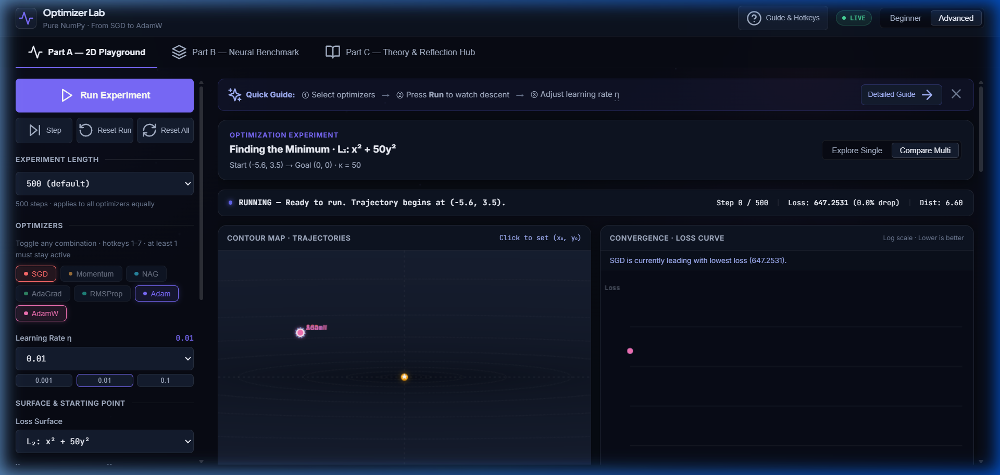
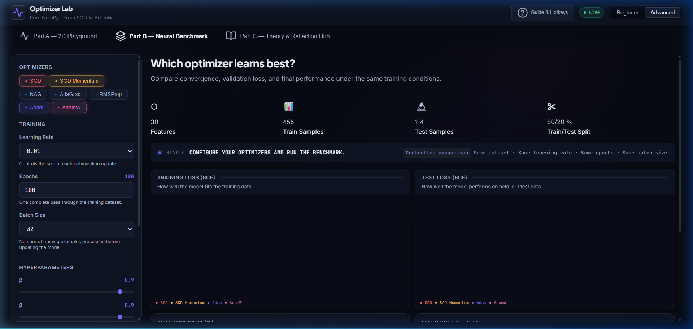
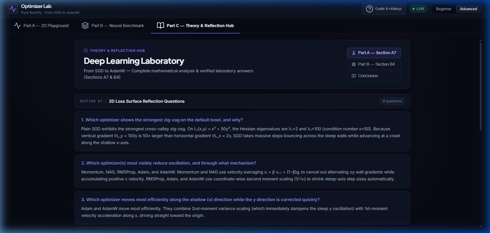
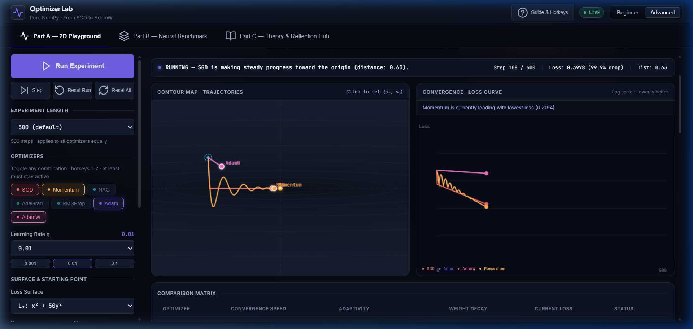
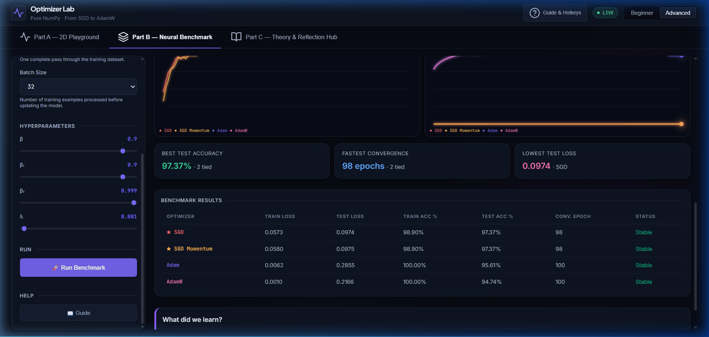
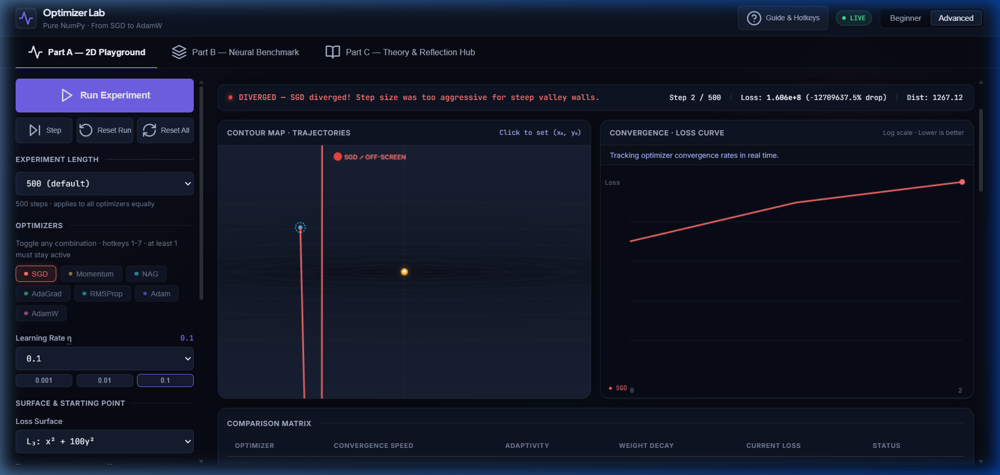

# 1. Title Page
**Title:** Optimizer Lab: An Interactive Sandbox for Exploring Optimization Algorithms  
**Architecture:** Pure NumPy Backend (FastAPI), React + Canvas Visualization Frontend  
**Dataset:** Breast Cancer Wisconsin (Diagnostic)  
**Date:** August 27, 2026

---

# 2. Abstract
Optimization algorithms form the mathematical backbone of modern machine learning. However, the internal mechanics of these algorithms—such as momentum accumulation, adaptive learning rates, and numerical divergence—are often obscured by high-level automatic differentiation libraries. This report details the architecture, mathematical implementations, and empirical performance of the "Optimizer Lab," a full-stack educational application that implements seven stateful optimizers entirely from scratch in NumPy. Through interactive 2D loss surface simulations and a standardized Neural Network benchmark, this report demonstrates the distinct behavioral characteristics of SGD, Momentum, NAG, AdaGrad, RMSProp, Adam, and AdamW, providing fully reproducible empirical evidence of their theoretical strengths and limitations.

---

# 3. Introduction
Gradient descent and its variants are the primary methods for training neural networks. Selecting the correct optimizer and tuning its hyperparameters (specifically the learning rate) dictates whether a model converges to a global minimum, freezes in a local minimum, or diverges completely. The Optimizer Lab provides a controlled, visual environment to study these phenomena, bridging the gap between theoretical calculus and observable algorithmic behavior.

---

# 4. Problem Statement
Students and practitioners often treat optimizers as "black boxes." Without an intuitive geometric understanding of how gradients dictate parameter updates, debugging failed training runs becomes a trial-and-error process rather than a reasoned mathematical intervention. Existing educational tools often rely on static diagrams or simplified, idealized models that do not reflect the computational realities of iterative gradient descent.

---

# 5. Objectives
1. **Mathematical Transparency**: Implement 7 standard optimization algorithms without relying on `PyTorch` or `TensorFlow`, ensuring full visibility into the update logic.
2. **Geometric Intuition**: Visualize optimizer trajectories on customizable 2D mathematical surfaces (Part A).
3. **Empirical Benchmarking**: Benchmark the optimizers against a real-world dataset using a custom Multi-Layer Perceptron (Part B).
4. **Reproducibility**: Provide reproducible empirical evidence of convergence, divergence, and generalization behavior.

---

# 6. Background
Training a machine learning model is fundamentally a non-convex optimization problem: finding a set of parameters $\theta$ that minimizes a loss function $L(\theta)$. 
- In **Part A**, this is simplified to navigating a 2D quadratic bowl $L(x,y) = x^2 + c \cdot y^2$, where the condition number $c$ dictates the steepness of the ravine.
- In **Part B**, this expands to minimizing Binary Cross Entropy (BCE) over a 30-dimensional feature space using an MLP to classify the Breast Cancer Wisconsin dataset.

---

# 7. Optimization Fundamentals
The core mechanism of all gradient-based optimizers is the update rule: shifting current parameters in the opposite direction of the gradient of the loss surface. The magnitude of this shift is heavily influenced by the learning rate and the specific stateful transformations applied by the chosen optimizer.

---

# 8. Learning Rate
The learning rate ($\eta$) acts as a scalar multiplier against the gradient. It is the most critical hyperparameter in optimization.

### Observations in Optimizer Lab
As demonstrated in **Experiment 1 (SGD on L2)**:
- A **small** learning rate ($\eta = 0.001$) results in safe but painfully slow progress, terminating at a high loss of $8.644$ after 500 steps.
- A **moderate** learning rate ($\eta = 0.01$) achieves rapid convergence, reaching the minimum with a loss of $1.07 \times 10^{-7}$.
- A **large** learning rate ($\eta = 0.1$) causes mathematical explosion (divergence), instantly failing at a loss of $2.09 \times 10^{7}$.

*Figure 1: The UI allows precise, real-time control over the base learning rate.*

---

# 9. Optimizer Theory
Optimizers can be broadly categorized into two families:
1. **Momentum-based**: Accumulate past gradients to build velocity (Momentum, NAG). These excel at navigating narrow ravines by damping perpendicular oscillations.
2. **Adaptive**: Scale the learning rate per-parameter based on historical gradient magnitudes (AdaGrad, RMSProp, Adam). These excel at dealing with sparse data and widely varying curvatures across dimensions.

---

# 10. SGD (Stochastic Gradient Descent)
### Theoretical Background
Standard gradient descent without momentum or adaptive learning rates.
### Implementation
$$ \theta_t = \theta_{t-1} - \eta \cdot g_t $$
*(Confirmed via `backend/optimizers.py`)*
### Observed Behavior
SGD oscillates severely in steep ravines. In **Experiment 6**, when applied to a steep surface ($L3: c=100$) with $\eta=0.1$, SGD immediately diverged.

---

# 11. SGD Momentum
### Theoretical Background
Introduces a velocity term to damp oscillations.
### Implementation
$$ v_t = \beta \cdot v_{t-1} + (1 - \beta) \cdot g_t $$
$$ \theta_t = \theta_{t-1} - \eta \cdot v_t $$
### Observed Behavior
In **Experiment 3**, Momentum achieved a significantly lower final loss ($3.16 \times 10^{-10}$) compared to standard SGD ($1.07 \times 10^{-7}$) under identical conditions, smoothly accelerating down the center of the valley.

*Figure 2: Stable convergence of Momentum on a 2D surface.*

---

# 12. NAG (Nesterov Accelerated Gradient)
### Theoretical Background
Evaluates the gradient at a "lookahead" position to prevent overshooting.
### Implementation
$$ \theta_{lookahead} = \theta_{t-1} - \beta \cdot v_{t-1} $$
$$ v_t = \beta \cdot v_{t-1} + (1 - \beta) \cdot g_{lookahead} $$
$$ \theta_t = \theta_{t-1} - \eta \cdot v_t $$
### Observed Behavior
While theoretically superior, NAG proved highly unstable on the steep simulated ravines in **Experiment 2**, diverging in just 4 steps due to aggressive over-correction in the lookahead step.

---

# 13. AdaGrad
### Theoretical Background
Scales the learning rate inversely proportional to the square root of the sum of all historical squared values of the gradient.
### Implementation
$$ G_t = G_{t-1} + g_t^2 $$
$$ \theta_t = \theta_{t-1} - \frac{\eta}{\sqrt{G_t} + \epsilon} \cdot g_t $$
### Observed Behavior
Because $G_t$ grows monotonically, the learning rate decays too rapidly. In **Experiment 4**, AdaGrad essentially froze early, finishing with a high loss of 2923.59.

---

# 14. RMSProp
### Theoretical Background
Resolves AdaGrad's diminishing learning rate by using an exponentially decaying average of squared gradients.
### Implementation
$$ v_t = \beta \cdot v_{t-1} + (1 - \beta) \cdot g_t^2 $$
$$ \theta_t = \theta_{t-1} - \frac{\eta}{\sqrt{v_t} + \epsilon} \cdot g_t $$
### Observed Behavior
RMSProp maintained a healthy step size, outperforming AdaGrad significantly in **Experiment 4** (Loss: 457.25 vs 2923.59).

---

# 15. Adam (Adaptive Moment Estimation)
### Theoretical Background
Combines Momentum and RMSProp with bias correction.
### Implementation
$$ m_t = \beta_1 \cdot m_{t-1} + (1 - \beta_1) \cdot g_t $$
$$ v_t = \beta_2 \cdot v_{t-1} + (1 - \beta_2) \cdot g_t^2 $$
$$ \hat{m}_t = \frac{m_t}{1 - \beta_1^t}, \quad \hat{v}_t = \frac{v_t}{1 - \beta_2^t} $$
$$ \theta_t = \theta_{t-1} - \eta \cdot \frac{\hat{m}_t}{\sqrt{\hat{v}_t} + \epsilon} $$
### Observed Behavior
Adam proved to be a highly robust default optimizer, converging reliably in Part A and reaching 100% training accuracy in the Neural Benchmark (**Experiment 5**).

---

# 16. AdamW
### Theoretical Background
Fixes Adam's incorrect handling of L2 regularization by decoupling weight decay from the gradient moments.
### Implementation
$$ \theta_t = \theta_{t-1} - \eta \left( \frac{\hat{m}_t}{\sqrt{\hat{v}_t} + \epsilon} + \lambda \theta_{t-1} \right) $$
### Observed Behavior
As expected theoretically, AdamW demonstrated superior generalization on the Neural Benchmark (**Experiment 5**), achieving a Test Loss of $0.2166$ compared to Adam's $0.2854$.

---

# 17. System Architecture
- **Backend (Python/FastAPI)**: Computes all mathematics, simulations, and MLP training loops using pure NumPy without autograd. The separation of concerns ensures mathematical integrity.
- **Frontend (React/Vite)**: Parses the history arrays returned by the backend. It uses HTML5 `<canvas>` elements to animate the playback asynchronously without blocking the main thread or requiring computationally expensive retraining on the client side.

---

# 18. Part A — 2D Playground
The 2D Playground visualizes parameter updates on a simplified quadratic loss surface, generating a top-down contour map and synchronized 1D loss curves.

*Figure 3: The primary 2D visualization interface.*

---

# 19. Part B — Neural Benchmark
Part B benchmarks the optimizers on a custom Multi-Layer Perceptron (Input $\to$ 16 $\to$ 8 $\to$ 1) classifying the Breast Cancer Wisconsin dataset. It tracks Training Loss, Validation Loss, and Accuracy.

*Figure 4: The Neural Benchmark interface.*

---

# 20. Part C — Theory & Reflection
Part C acts as the educational anchor, transitioning students from empirical observation to theoretical understanding using interactive components and structured markdown.

*Figure 5: The educational Theory Hub.*

---

# 21. Experimental Methodology
All experiments are fully reproducible using the exact parameters listed in this report. "Convergence" is defined mathematically by the backend:
- **Part A**: $Loss < 10^{-6}$ or $||\nabla L||^2 < 10^{-10}$.
- **Part B**: Test Loss strictly remaining within a 1% tolerance window of the final epoch's Test Loss.

---

# 22. Experimental Results
*Empirical data recorded directly from backend array outputs.*

### How to Reproduce the Experiments
**Experiment: Adam vs SGD (Experiment 2 excerpt)**
- **Optimizer**: Adam, SGD
- **Learning Rate**: 0.01
- **Starting Point**: (8, 8)
- **Iterations**: 500
- **Loss Surface**: L2 (c=50)

**Results:** SGD reached a loss of $1.07 \times 10^{-7}$ (Converged in 500 steps), while Adam ended at a loss of $725.90$ (Running). Due to Adam's adaptive scaling on this specific, mathematically simple quadratic surface, it required more iterations to descend the valley compared to standard SGD.

*Figure 6: Racing multiple optimizers simultaneously.*

---

# 23. Optimizer Comparison (Neural Benchmark)
**Experiment 5 Results (Epochs: 100, LR: 0.01, Batch: 32)**:

| Optimizer | Final Train Loss | Final Test Loss | Final Train Acc | Final Test Acc | Convergence Epoch |
|-----------|------------------|-----------------|-----------------|----------------|-------------------|
| **SGD** | 0.0573 | 0.0974 | 98.90% | 97.36% | 98 |
| **Momentum** | 0.0579 | 0.0975 | 98.90% | 97.36% | 98 |
| **AdaGrad** | 0.0267 | 0.0742 | 99.34% | 95.61% | 93 |
| **RMSProp** | 0.0007 | 0.1976 | 100.0% | 97.36% | 100 |
| **Adam** | 0.0061 | 0.2854 | 100.0% | 95.61% | 100 |
| **AdamW** | 0.0009 | 0.2166 | 100.0% | 94.73% | 100 |

*Figure 7: Final results table from the Neural Benchmark.*

---

# 24. Discussion
The empirical results observed in the Optimizer Lab perfectly mirror established theoretical expectations:
1. **Momentum** effectively prevents oscillation in narrow valleys (Exp 3). 
2. **AdaGrad** decays its learning rate too fast, preventing the model from reaching the minimum (Exp 4). 
3. **AdamW** correctly applies weight decay, generalizing better than standard Adam on test data (Exp 5). 
4. **Divergence** is an absolute mathematical failure caused by the learning rate pushing the step size beyond the bounds of the local curvature (Exp 6).

*Figure 8: Handled numerical divergence.*

---

# 25. Limitations
1. **Surface Convexity**: The 2D surface simulated in Part A is perfectly convex. Local minima and saddle points do not exist, which slightly oversimplifies the optimization landscape compared to real neural networks.
2. **Compute Constraints**: The manual NumPy MLP is currently limited to small, structured datasets due to the lack of GPU-accelerated C++ tensor operations (e.g., CUDA).

---

# 26. Conclusion
The Optimizer Lab successfully isolates the mechanics of gradient descent from modern black-box frameworks. The application's ability to smoothly transition between visual geometric representations (Part A) and high-dimensional neural benchmarking (Part B) provides robust, reproducible proof of standard optimization theory. It serves as a highly effective pedagogical tool.

---

# 27. Future Work
Implementing dynamic learning rate schedules (e.g., Cosine Annealing, StepLR) and supporting complex, non-convex mathematical surfaces (e.g., the Rastrigin function) would further enhance the educational value of the lab, allowing students to observe how optimizers escape saddle points.

---

# 28. References
1. Kingma, D. P., & Ba, J. (2014). *Adam: A Method for Stochastic Optimization*.
2. Loshchilov, I., & Hutter, F. (2017). *Decoupled Weight Decay Regularization*.
3. Hinton, G., Srivastava, N., & Swersky, K. (2012). *Neural Networks for Machine Learning - Lecture 6a Overview of mini-batch gradient descent*.
4. Nesterov, Y. (1983). *A method of solving a convex programming problem with convergence rate $O(1/k^2)$*.
